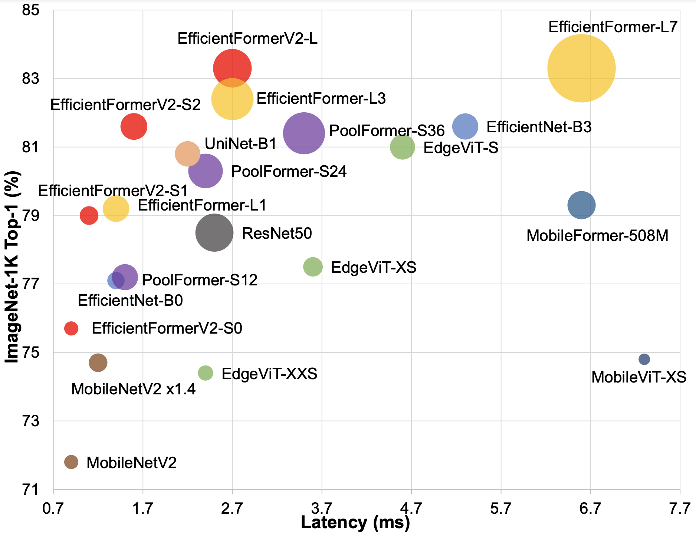

## EfficientFormerV2<br><sub>Rethinking Vision Transformers for MobileNet Size and Speed</sub>

[arXiv](https://arxiv.org/abs/2212.08059) | [PDF](https://arxiv.org/pdf/2212.08059.pdf)

<p align="center">
   <br>
  Models are trained on ImageNet-1K and deployed on iPhone 12 with CoreMLTools to get latency.
</p>

>[Rethinking Vision Transformers for MobileNet Size and Speed](https://arxiv.org/abs/2212.08059)<br>
>[Yanyu Li](https://scholar.google.com/citations?view_op=list_works&hl=en&hl=en&user=XUj8koUAAAAJ&sortby=pubdate)<sup>1,2</sup>, [Ju Hu](https://www.linkedin.com/in/erichuju/)<sup>1</sup>, [Yang Wen](https://www.linkedin.com/in/yang-wen-76749924/)<sup>1</sup>, [Georgios Evangelidis](https://sites.google.com/site/georgeevangelidis/)<sup>1</sup>, [Kamyar Salahi](https://www.linkedin.com/in/kamyarsalahi/)<sup>3</sup>, <br>[Yanzhi Wang](https://coe.northeastern.edu/people/wang-yanzhi/)<sup>2</sup>, [Sergey Tulyakov](http://www.stulyakov.com/)<sup>1</sup>, [Jian Ren](https://alanspike.github.io/)<sup>1</sup>  
><sup>1</sup>Snap Inc., <sup>2</sup>Northeastern University, <sup>3</sup>UC Berkeley

<details>
  <summary>
  <font size="+1">Abstract</font>
  </summary>
With the success of Vision Transformers (ViTs) in computer vision tasks, recent arts try to optimize the performance and complexity of ViTs to enable efficient deployment on mobile devices.
Multiple approaches are proposed to accelerate attention mechanism, improve inefficient designs, or incorporate mobile-friendly lightweight convolutions to form hybrid architectures.
However, ViT and its variants still have higher latency or considerably more parameters than lightweight CNNs, even true for the years-old MobileNet. 
In practice, latency and size are both crucial for efficient deployment on resource-constraint hardware. 
In this work, we investigate a central question, can transformer models run as fast as MobileNet and maintain a similar size? 
We revisit the design choices of ViTs and propose an improved supernet with low latency and high parameter efficiency. 
We further introduce a fine-grained joint search strategy that can find efficient architectures by optimizing latency and number of parameters simultaneously. The proposed models, EfficientFormerV2, achieve about 4% higher top-1 accuracy than MobileNetV2 and MobileNetV2x1.4 on ImageNet-1K with similar latency and parameters. We demonstrate that properly designed and optimized vision transformers can achieve high performance with MobileNet-level size and speed.
</details>

<br>

### Changelog and ToDos
- [x] Add EfficientFormerV2 model family, including `efficientformerv2_s0`, `efficientformerv2_s1`, `efficientformerv2_s2` and `efficientformerv2_l`. 
- [x] Pretrained checkpoints of EfficientFormerV2 on ImageNet-1K are released. 
- [x] Update EfficientFormerV2 in downstream tasks (detection, segmentation). 
- [x] Release checkpoints in downstream tasks. 
- [x] Add extra tools for profiling and deployment (we use CoreML==5.2 and Torch==1.11), example usage: 

```
python toolbox.py --model efficientformerv2_l --ckpt weights/eformer_l_450.pth --onnx --coreml
```


## EfficientFormer<br><sub>Vision Transformers at MobileNet Speed</sub>

[arXiv](https://arxiv.org/abs/2206.01191) | [PDF](https://arxiv.org/pdf/2206.01191.pdf)


<p align="center">
   <br>
  Models are trained on ImageNet-1K and measured by iPhone 12 with CoreMLTools to get latency.
</p>


>[EfficientFormer: Vision Transformers at MobileNet Speed](https://arxiv.org/abs/2206.01191)<br>
>[Yanyu Li](https://scholar.google.com/citations?view_op=list_works&hl=en&hl=en&user=XUj8koUAAAAJ&sortby=pubdate)<sup>1,2</sup>, [Genge Yuan](https://scholar.google.com/citations?user=tBIAgtgAAAAJ&hl)<sup>1,2</sup>, [Yang Wen](https://www.linkedin.com/in/yang-wen-76749924/)<sup>1</sup>, [Eric Hu](https://www.linkedin.com/in/erichuju/)<sup>1</sup>, [Georgios Evangelidis](https://sites.google.com/site/georgeevangelidis/)<sup>1</sup>, <br>[Sergey Tulyakov](http://www.stulyakov.com/)<sup>1</sup>, [Yanzhi Wang](https://coe.northeastern.edu/people/wang-yanzhi/)<sup>2</sup>, [Jian Ren](https://alanspike.github.io/)<sup>1</sup>  
><sup>1</sup>Snap Inc., <sup>2</sup>Northeastern University


<details>
  <summary>
  <font size="+1">Abstract</font>
  </summary>
    Vision Transformers (ViT) have shown rapid progress in computer vision tasks, achieving promising results on various benchmarks. However, due to the massive number of parameters and model design, e.g., attention mechanism, ViT-based models are generally times slower than lightweight convolutional networks. Therefore, the deployment of ViT for real-time applications is particularly challenging, especially on resource-constrained hardware such as mobile devices. Recent efforts try to reduce the computation complexity of ViT through network architecture search or hybrid design with MobileNet block, yet the inference speed is still unsatisfactory. This leads to an important question: can transformers run as fast as MobileNet while obtaining high performance? To answer this, we first revisit the network architecture and operators used in ViT-based models and identify inefficient designs. Then we introduce a dimension-consistent pure transformer (without MobileNet blocks) as a design paradigm. Finally, we perform latency-driven slimming to get a series of final models dubbed EfficientFormer. Extensive experiments show the superiority of EfficientFormer in performance and speed on mobile devices. Our fastest model, EfficientFormer-L1, achieves 79.2% top-1 accuracy on ImageNet-1K with only 1.6 ms inference latency on iPhone 12 (compiled with CoreML), which runs as fast as MobileNetV2x1.4 (1.6 ms, 74.7% top-1), and our largest model, EfficientFormer-L7, obtains 83.3% accuracy with only 7.0 ms latency. Our work proves that properly designed transformers can reach extremely low latency on mobile devices while maintaining high performance.
</details>


<br>


## Classification on ImageNet-1K

### Models

| Model | Top-1 (300/450)| #params | MACs | Latency | ckpt | ONNX | CoreML |
|:---------------|:----:|:---:|:--:|:--:|:--:|:--:|:--:|
| EfficientFormerV2-S0 |   75.7 / 76.2   |     3.5M    |   0.40B   |      0.9ms     |  [S0](https://drive.google.com/file/d/1PXb7b9pv9ZB4cfkRkYEdwgWuVwvEiazq/view?usp=share_link)    |   [S0](https://drive.google.com/file/d/1xWev98ENruLnnxgFXORmrYzNG5Y8b8y6/view?usp=share_link)   |    [S0](https://drive.google.com/file/d/19G3RGcH42gqPBa42CV3yIOmSmVVFqW0X/view?usp=share_link)    |
| EfficientFormerV2-S1 |   79.0 / 79.7   |     6.1M    |   0.65B   |      1.1ms     |   [S1](https://drive.google.com/file/d/1EKe1vt-3mG7iceVIMaET_DyISzVTJMn8/view?usp=share_link)   |   [S1](https://drive.google.com/file/d/1f4eYkY3Tkmyn_GrDk4QqbpWYcF07CukT/view?usp=share_link)   |    [S1](https://drive.google.com/file/d/1EXI0uq3yt0KpMlItjJlnghYfAzWgdbRj/view?usp=share_link)    |
| EfficientFormerV2-S2 |   81.6 / 82.0   |    12.6M   |   1.25B   |      1.6ms     |   [S2](https://drive.google.com/file/d/1gjbFyB5T_yAkmzHNuXEljqScYVQZafMQ/view?usp=share_link)   |   [S2](https://drive.google.com/file/d/1kJj2UxUQR-ro4WslcnsukcJF9BXi0FMC/view?usp=share_link)   |    [S2](https://drive.google.com/file/d/1KQw7UMujsHrLUCDOY-pO6rM7zfp7cpDY/view?usp=share_link)    |
| EfficientFormerV2-L |   83.3 / 83.5   |    26.1M    |   2.56B   |      2.7ms     |  [L](https://drive.google.com/file/d/1sRXNBHl_ewHBMwwYZVsOJo1k6JpcNJn-/view?usp=share_link)    |   [L](https://drive.google.com/file/d/18GfCWWdYYcEz_AOmoO6J7dW8xMtkIpcm/view?usp=share_link)   |     [L](https://drive.google.com/file/d/1Ynu7fTbqPEW9tSVZdR7ZAN1edUFAocGT/view?usp=share_link)   |


| Model | Top-1 Acc.| Latency | Pytorch Checkpoint | CoreML | ONNX |
| :------------ | :--: | :---: | :---: |:---: | :---: |
| EfficientFormer-L1 |79.2 (80.2) | 1.6ms| [L1-300](https://drive.google.com/file/d/1wtEmkshLFEYFsX5YhBttBOGYaRvDR7nu/view?usp=sharing) ([L1-1000](https://drive.google.com/file/d/11SbX-3cfqTOc247xKYubrAjBiUmr818y/view?usp=sharing)) | [L1](https://drive.google.com/file/d/1MEDcyeKCBmrgVGrHX8wew3l4ge2CWdok/view?usp=sharing) | [L1](https://drive.google.com/file/d/10NMPW8SLLiTa2jwTTuILDQRUzMvehmUM/view?usp=sharing) |
| EfficientFormer-L3 |82.4 | 3.0ms| [L3](https://drive.google.com/file/d/1OyyjKKxDyMj-BcfInp4GlDdwLu3hc30m/view?usp=sharing) | [L3](https://drive.google.com/file/d/12xb0_6pPAy0OWdW39seL9TStIqKyguEj/view?usp=sharing) | [L3](https://drive.google.com/file/d/1DEbsOEzP4ljS6-ka86BtwQWiVxkylCaX/view?usp=sharing) |
| EfficientFormer-L7 |83.3  | 7.0ms| [L7](https://drive.google.com/file/d/1cVw-pctJwgvGafeouynqWWCwgkcoFMM5/view?usp=sharing) | [L7](https://drive.google.com/file/d/1CnhAyfylpvvebT9Yn3qF8vrUFjZjuO3F/view?usp=sharing) | [L7](https://drive.google.com/file/d/1u6But9JQ9Wd7vlaFTGcYm5FiGnQ8y9eS/view?usp=sharing) |


## Latency Measurement 

The latency reported in EffcientFormerV2 for iPhone 12 (iOS 16) uses the benchmark tool from [XCode 14](https://developer.apple.com/videos/play/wwdc2022/10027/).

For EffcientFormerV1, we use the [coreml-performance](https://github.com/vladimir-chernykh/coreml-performance). Thanks for the nice-implemented latency measurement! 

*Tips*: MacOS+XCode and a mobile device (iPhone 12) are needed to reproduce the reported speed. 


## ImageNet  

### Prerequisites
`conda` virtual environment is recommended. 
```
conda install pytorch torchvision cudatoolkit=11.3 -c pytorch
pip install timm
pip install submitit
```

### Data preparation

Download and extract ImageNet train and val images from http://image-net.org/. The training and validation data are expected to be in the `train` folder and `val` folder respectively:
```
|-- /path/to/imagenet/
    |-- train
    |-- val
```

### Single machine multi-GPU training

We provide an example training script `dist_train.sh` using PyTorch distributed data parallel (DDP). 

To train EfficientFormer-L1 on an 8-GPU machine:

```
sh dist_train.sh efficientformer_l1 8
```

Tips: specify your data path and experiment name in the script! 

### Multi-node training

On a Slurm-managed cluster, multi-node training can be launched through [submitit](https://github.com/facebookincubator/submitit), for example, 

```
sh slurm_train.sh efficientformer_l1
```

Tips: specify GPUs/CPUs/memory per node in the script based on your resource!

### Testing 

We provide an example test script `dist_test.sh` using PyTorch distributed data parallel (DDP). 
For example, to test EfficientFormer-L1 on an 8-GPU machine:

```
sh dist_test.sh efficientformer_l1 8 weights/efficientformer_l1_300d.pth
```

## Using EfficientFormer as backbone
[Object Detection and Instance Segmentation](detection/README.md)<br>
[Semantic Segmentation](segmentation/README.md)
## Acknowledgement

Classification (ImageNet) code base is partly built with [LeViT](https://github.com/facebookresearch/LeViT) and [PoolFormer](https://github.com/sail-sg/poolformer). 

The detection and segmentation pipeline is from [MMCV](https://github.com/open-mmlab/mmcv) ([MMDetection](https://github.com/open-mmlab/mmdetection) and [MMSegmentation](https://github.com/open-mmlab/mmsegmentation)). 

Thanks for the great implementations! 

## Citation

If our code or models help your work, please cite our papers:
```BibTeX
@article{li2022efficientformer,
  title={EfficientFormer: Vision Transformers at MobileNet Speed},
  author={Li, Yanyu and Yuan, Geng and Wen, Yang and Hu, Ju and Evangelidis, Georgios and Tulyakov, Sergey and Wang, Yanzhi and Ren, Jian},
  journal={arXiv preprint arXiv:2206.01191},
  year={2022}
}
```
```BibTeX
@article{li2022rethinking,
  title={Rethinking Vision Transformers for MobileNet Size and Speed},
  author={Li, Yanyu and Hu, Ju and Wen, Yang and Evangelidis, Georgios and Salahi, Kamyar and Wang, Yanzhi and Tulyakov, Sergey and Ren, Jian},
  journal={arXiv preprint arXiv:2212.08059},
  year={2022}
}
```

